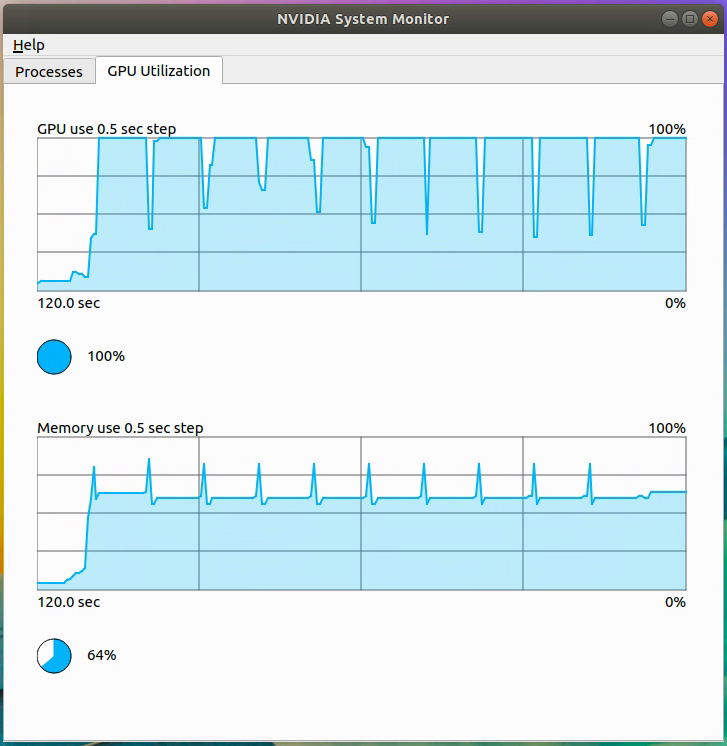
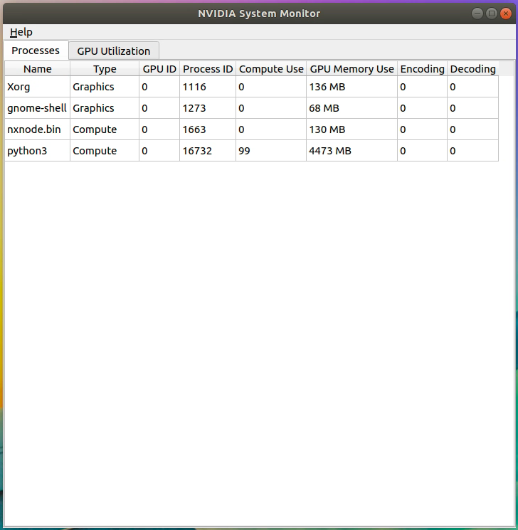

# nvidia-system-monitor
<div style="text-align: center;">
    
</div>

Task Manager for Linux for Nvidia graphics cards





# Dependencies
Qt 5.11+ is required.
* Use `sudo apt install qtdeclarative5-dev` to install QT dependencies.
* Visit https://www.qt.io/download-open-source to download the QT installer at the bottom of the page. 
Install libraries for any version of Qt 5.11+ to whereever, e.g. `/opt/Qt`.

* `nvidia-smi`

# Building
```
cmake -DCMAKE_BUILD_TYPE=Release -G "Unix Makefiles"
make -j4
```
If making fails, manually edit the `CMakeCache.txt` file to point `Qt5Core_DIR`, `Qt5Gui_DIR`, and `Qt5Widgets_DIR` to the correct places. They will be under `[Qt location]/5.XX.X/gcc_64/lib/cmake/`.
Around line 180-ish in `CMakeCache.txt` you want these three things to be pointed at the Qt direction.
For example, here Qt is installed to `/home/Qt`

```
//The directory containing a CMake configuration file for Qt5Core.
Qt5Core_DIR:PATH=/home/Qt/5.12.5/gcc_64/lib/cmake/Qt5Core/
   
//The directory containing a CMake configuration file for Qt5Gui.
Qt5Gui_DIR:PATH=/home/Qt/5.12.5/gcc_64/lib/cmake/Qt5Gui/

//The directory containing a CMake configuration file for Qt5Widgets.
Qt5Widgets_DIR:PATH=/home/Qt/5.12.5/gcc_64/lib/cmake/Qt5Widgets
```

To launch type `qnvsm`

The option -j describes the number of parallel processes for the build. In this case make will try to use 4 cores for the build.

If you want to use an IDE for Linux you can try CLion for instance.

# Config
Here example of simple config located in `~/.config/nvidia-system-monitor/config`:
```
# time in ms
updateDelay 500
graphLength 120000

#           gpu id  red  green  blue
gpuColor    0       0    0      255
gpuColor    1       0    255    0
gpuColor    2       255  0      0
```

# Donate
[Open DONATE.md](DONATE.md)
